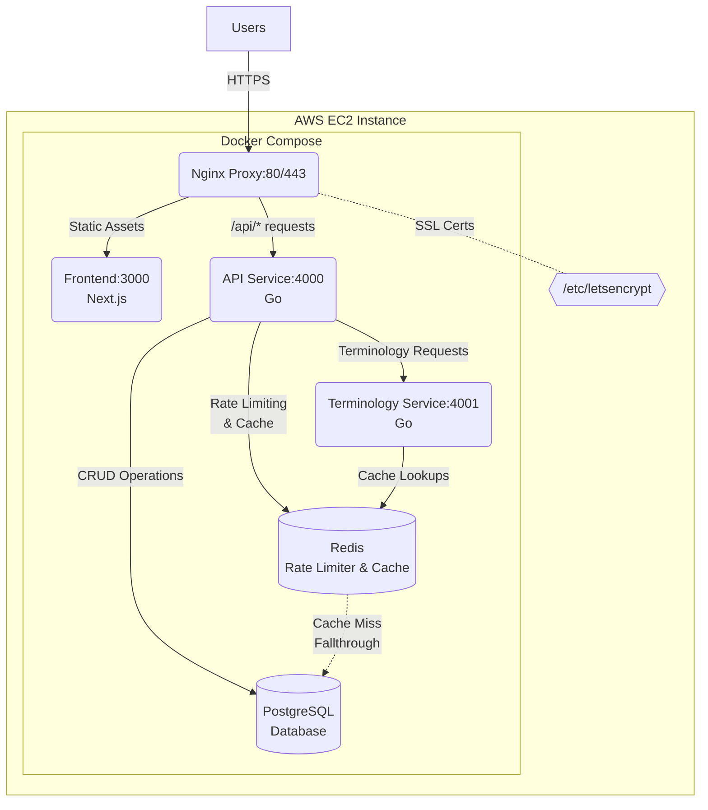

# textCare
*Telemedicine web application prototype*

**Live Demo**: https://nexmed.org
**Tech Stack**: Go • PostgreSQL • Next.js • Docker • AWS 

## Development Setup

### Prerequisites
- Go 1.20+
- Node.js 18+
- PostgreSQL 15+
- Make
- Docker

### Environment Variables

| Variable               | Description                                  | Example Value                          |
|------------------------|----------------------------------------------|----------------------------------------|
| `NEXT_PUBLIC_API_URL`  | API base URL (client-accessible)            | `http://localhost:4000`                |
| `DB_USER`              | PostgreSQL user for connecting to the database | `textcare_user` |
| `DB_PASSWORD`              | Password for the PostgreSQL user | `password` |
| `DB_HOST`              | Host where PostgreSQL is running | `localhost` |
| `DB_PORT`              | Port on which PostgreSQL listens | `5432` |
| `DB_NAME`              |Database name | `textcare` |
| `CORS_ALLOWED_ORIGINS` | Allowed origins for CORS                    | `http://localhost:3000`                |

## Base Functional Requirements
- **As a user**, I can:
  - Select a doctor that practices in my state
  - Add medical conditions using autocomplete
- **As an admin**, I can:
  - Add additional providers

## Possible Additional Functional Requirements
- **As a user**, I can:
  - Pay for a subscription service
  - Add current medications using autocomplete
  - Receive text/email notifications
  - Receive medications that have been prescribed to me
  - See a record of care that I have received
  - Message with my provider on web and mobile
  - Schedule appointments
- **As a provider**, I can:
  - See current and past appointments
  - Provide my availability / schedule appointments
  - Message with patients
  - Prescribe medications to patients
  - Have pre-populated workflows for common clinical problems (UTI, PNA, etc)
- **As an admin**, I can:
  - See important business-level metrics (user retention, new signups, no-shows, provider efficiency)

## Non-Functional Requirements
- Data is secure and HIPAA compliant
- Elastic architecture designed for horizontal scaling
- Consistency > availability 

## Backend To Do

- <s>Routing</s>
- <s>Logging</s>
- <s>Graceful shutdown</s>
- <s>Authentication/access control</s>
- <s>Patient/provider endpoints</s>
- Create separate payments service and integrate with Stripe payments API
- Seed fake data
- ?Prescriptions API integration
- ?Scheduling
- ?APN/Firebase integration
- **Autocomplete API**:
  - <s>In-memory ICD-10 implementation</s>
  - <s> Evaluate SNOMED alternatives for patient-facing autocomplete (CMT) </s>
  - Investigate Soundex algorithm
  - Explore Elasticsearch integration
  - Expand to medication search
  - Redis caching layer

## Frontend To Do

- Match Figma design (in progress)
- <s> Form validation (React Hook Form + Zod) </s>
- <s> Modular component architecture </s>
- Automated testing
- <s> Performance metrics / optimization </s>

## Infra To Do

- Production-grade logging and alerting
- <s> Dockerization </s>
- <s> Service oriented architecture </s>
- GRPC?
- Terraform for infrastructure provisioning
- Redis cache for API rate-limiter

## ML To Do

- NLP symptom analysis
- LLM triage system
- Predictive no-show modeling
- Treatment recommendation engine

## Data To Do

- ETL pipeline for metrics
- Anonymized data exports
- Audit logging system
- Compliance reporting

## Deployment (current setup)

- Install Docker Compose on the host machine
- Setup HTTPS (sudo certbot certonly --standalone -d <site>.org -d www.<site>.org) 

---

*Project status: Active development - architecture subject to change*
